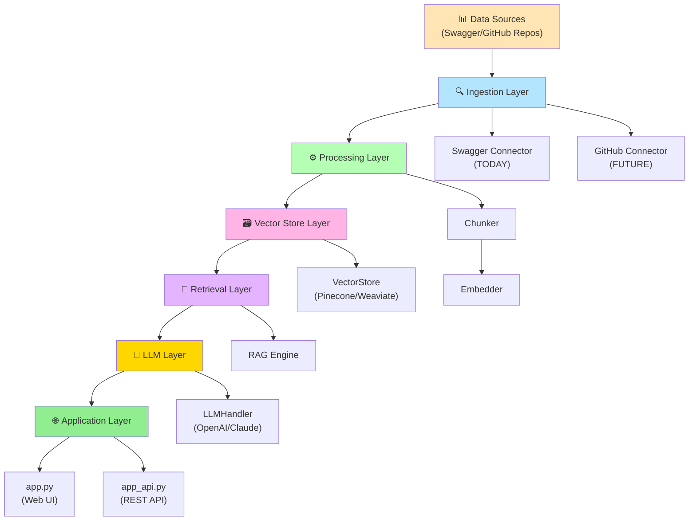
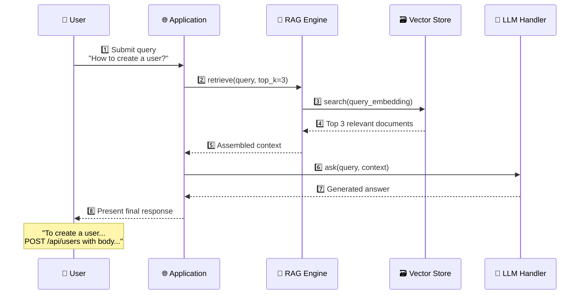
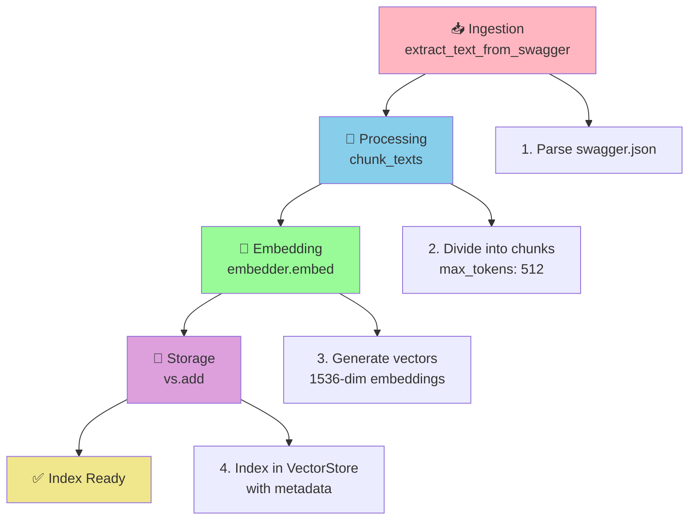
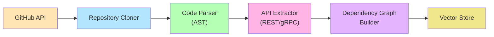
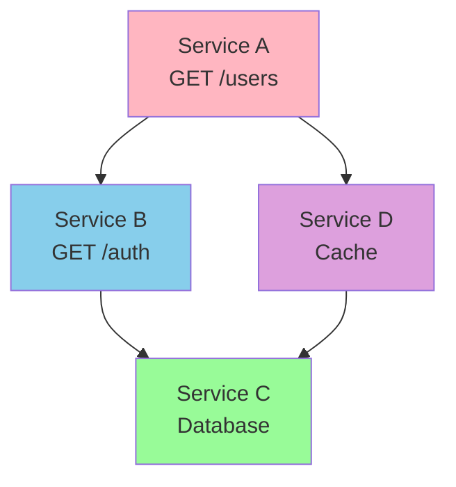
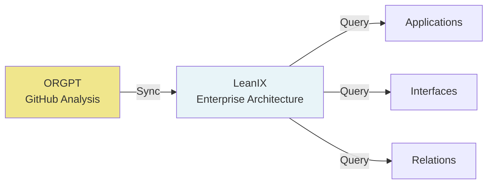
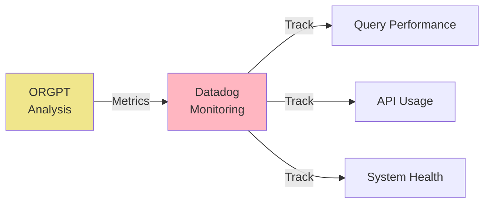
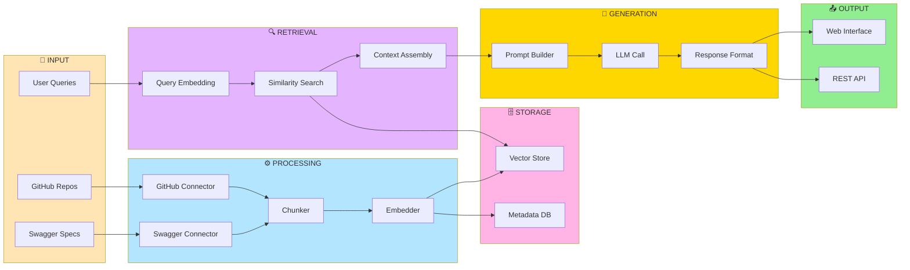
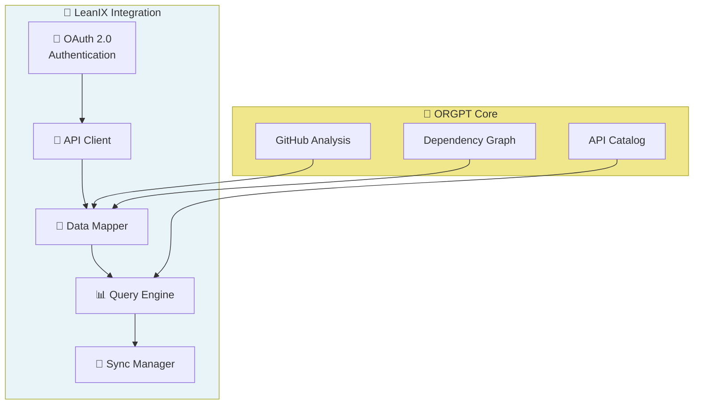
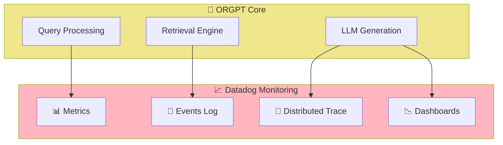

# 🤖 ORGPT - Intelligent Organization API Documentation & Dependency Analysis System

> **Orgpt** is an intelligent system for API analysis and documentation based on **RAG (Retrieval-Augmented Generation)**. It enables querying APIs, understanding service dependencies, and generating architectural insights using LLMs.

## 📋 Project Description

### Overview
ORGPT combines **GitHub repository ingestion**, **code processing**, **vector search**, and **natural language generation** to build a smart assistant that understands the architecture of your systems.

### Current Use Cases
- ✅ Query API specifications (Swagger/OpenAPI)
- ✅ Search endpoint documentation
- ✅ Generate context-aware answers about APIs

### Future Use Cases
- 🎯 Direct analysis of GitHub repositories
- 🎯 Extract API information from source code
- 🎯 Map dependency graphs between services
- 🎯 Generate impact reports for code changes
- 🎯 Detect technical debt
- 🎯 Integrate with **LeanIX** for enterprise architecture
- 🎯 Real-time monitoring with **Datadog**

---

## 🏗️ System Architecture

### Main Components



---

## 🔄 Execution Flow - Query (User Query)



---

## 🏗️ Indexing Flow (Build Index)



---

## 🚀 Future Roadmap - GitHub Repository Analysis

### Phase 1: GitHub Connector (Next 4 weeks)


**Tasks:**
- [ ] Implement GitHub API client with OAuth authentication
- [ ] Clone/analyze repositories
- [ ] Parse code (Python/TypeScript/Java)
- [ ] Extract API decorators (FastAPI, Flask, Express)
- [ ] Map imports and dependencies

### Phase 2: Dependency Graph Analysis


**Features:**
- Service dependency graph
- Change impact analysis
- Cycle detection
- Criticality analysis

### Phase 3: LeanIX Integration


### Phase 4: Datadog Integration


---

## 📁 Project Structure

```
orgpt/
├── README.md                    # This file
├── requirements.txt             # Python dependencies
├── main.py                      # Main entry point
├── index_builder.py             # Index building script
├── app.py                       # Web interface (Streamlit)
├── app_api.py                   # REST API (FastAPI)
├── app_local.py                 # Local execution
│
├── ingestion/                   # 📥 Ingestion Layer
│   ├── __init__.py
│   ├── swagger_connector.py     # Parse Swagger/OpenAPI (TODAY)
│   └── github_connector.py      # Analyze GitHub (FUTURE)
│
├── processing/                  # ⚙️ Processing Layer
│   ├── __init__.py
│   ├── chunker.py               # Split text into chunks
│   └── embedder.py              # Generate vector embeddings
│
├── vector_store/                # 🗃️ Storage Layer
│   ├── __init__.py
│   └── store.py                 # Abstract VectorStore interface
│
├── retrieval/                   # 🔎 Retrieval Layer
│   ├── __init__.py
│   └── rag_engine.py            # RAG (Retrieval-Augmented Generation)
│
├── llm/                         # 🤖 LLM Layer
│   ├── __init__.py
│   └── llm_layer.py             # LLM model interface
│
├── integrations/                # 🔗 External Integrations (FUTURE)
│   ├── leanix_connector.py      # LeanIX connection
│   └── datadog_client.py        # Datadog telemetry
│
├── data/                        # 📊 Data
│   ├── sample_swagger.json      # Sample Swagger
│   └── indices/                 # Vector indices
│
└── templates/                   # 🎨 Web templates
    ├── index.html
    └── styles.css
```

---

## ⚡ Installation and Configuration

### Prerequisites
- Python 3.8+
- OpenAI API Key (or local model)
- Vector Store (Pinecone, Weaviate, or local FAISS)

### Setup

```bash
# 1. Clone repository
git clone https://github.com/karthaveerya-droid/Orgpt.git
cd Orgpt

# 2. Create virtual environment
python -m venv venv
source venv/bin/activate  # Windows: venv\Scripts\activate

# 3. Install dependencies
pip install -r requirements.txt

# 4. Configure environment variables
cat > .env << EOF
# OpenAI
OPENAI_API_KEY=your-api-key

# Vector Store (select one)
VECTOR_STORE_TYPE=pinecone  # or: weaviate, faiss
PINECONE_API_KEY=your-key
PINECONE_INDEX_NAME=orgpt

# GitHub (FUTURE)
GITHUB_TOKEN=your-token

# LeanIX (FUTURE)
LEANIX_API_KEY=your-key
LEANIX_WORKSPACE_ID=your-workspace

# Datadog (FUTURE)
DATADOG_API_KEY=your-key
DATADOG_APP_KEY=your-app-key
EOF
```

---

## 🚀 Usage

### 1. Build Index (Indexing)

```bash
python index_builder.py --source swagger --path sample_swagger.json
```

**Expected output:**
```
[INFO] Extracting Swagger documentation...
[INFO] Splitting into chunks (512 tokens max)...
[INFO] Generating 45 embeddings...
[INFO] Indexing in VectorStore...
✅ Swagger data indexed successfully!
```

### 2. Query Data (Query)

```bash
python main.py
# Input: "How to create a user?"
# Response: "To create a user, make a POST request to..."
```

### 3. Web Interface (Streamlit)

```bash
streamlit run app.py
```

Access: `http://localhost:8501`

### 4. REST API (FastAPI)

```bash
uvicorn app_api:app --reload
```

Access: `http://localhost:8000/docs`

---

## 📊 REST API Endpoints (Future)

### Query Endpoint
```http
POST /api/query
Content-Type: application/json

{
  "question": "How to authenticate users?",
  "top_k": 3,
  "context_window": 2000
}

Response:
{
  "answer": "To authenticate users...",
  "sources": ["endpoint_id_1", "endpoint_id_2"],
  "confidence": 0.95,
  "processing_time_ms": 234
}
```

### Index Status
```http
GET /api/index/status

Response:
{
  "indexed_documents": 450,
  "total_embeddings": 1200,
  "last_update": "2024-03-20T15:30:00Z",
  "vector_store": "pinecone",
  "status": "healthy"
}
```

### GitHub Analysis (FUTURE)
```http
POST /api/github/analyze
Content-Type: application/json

{
  "repo": "your-org/your-repo",
  "branch": "main",
  "extract_apis": true,
  "generate_dependency_graph": true
}

Response:
{
  "services": [
    {
      "name": "UserService",
      "endpoints": 12,
      "dependencies": ["AuthService", "DatabaseLayer"]
    }
  ],
  "dependency_graph": {...},
  "analysis_id": "analysis_123"
}
```

---

## 🔧 Component Details

### 1. Ingestion Layer (Data Extraction)

#### Swagger Connector (Current)
```python
from ingestion.swagger_connector import extract_text_from_swagger_sources

docs = extract_text_from_swagger_sources("sample_swagger.json")
# Returns: ["GET /users - Retrieves list of users...", ...]
```

#### GitHub Connector (Future)
```python
from ingestion.github_connector import extract_apis_from_github

apis = extract_apis_from_github(
    repo="org/repo",
    patterns=["@app.route", "@router.get", "@app.post"],
    languages=["python", "typescript", "java"]
)
# Returns: [APIInfo, APIInfo, ...]
```

### 2. Processing Layer (Data Processing)

```python
from processing.chunker import chunk_texts
from processing.embedder import Embedder

# Chunking
chunks = chunk_texts(
    texts=docs,
    chunk_size=512,
    overlap=50
)

# Embedding
embedder = Embedder(model="text-embedding-3-large")
embeddings = embedder.embed(chunks)
```

### 3. Vector Store Layer (Storage)

```python
from vector_store.store import VectorStore

vs = VectorStore("pinecone", index_name="orgpt")

# Add documents
vs.add(
    ids=["doc_1", "doc_2"],
    texts=chunks,
    embeddings=embeddings,
    metadata={"source": "swagger", "version": "1.0"}
)

# Search
results = vs.search(
    query_embedding=query_vec,
    top_k=3,
    filters={"source": "swagger"}
)
```

### 4. Retrieval Layer (Context Retrieval)

```python
from retrieval.rag_engine import RAGEngine

rag = RAGEngine(vector_store=vs)

retrieved = rag.retrieve(
    query="How to create a user?",
    top_k=3
)
# Returns: {"documents": [...], "scores": [...], "metadata": [...]}
```

### 5. LLM Layer (Response Generation)

```python
from llm.llm_layer import LLMHandler

llm = LLMHandler(model="gpt-4")

answer = llm.ask(
    query="How to create a user?",
    context="GET /users returns...\nPOST /users creates...",
    temperature=0.3
)
# Returns: "To create a user, make a POST to /users with..."
```

---

## 🔗 Complete Flow Diagram



---

## 🔗 Future Integrations

### LeanIX Integration
Sync with enterprise architecture platform:



### Datadog Integration
Monitor system health and performance:



---

## 📊 Usage Examples

### Case 1: Analyze an API
```bash
$ python main.py
> Question: "What are all the endpoints for managing users?"

Response:
- GET /api/v1/users - Retrieves paginated user list
- GET /api/v1/users/{id} - Retrieves a specific user
- POST /api/v1/users - Creates a new user
- PUT /api/v1/users/{id} - Updates a user
- DELETE /api/v1/users/{id} - Deletes a user

Documentation found in: swagger_v1.0
```
---

## 🎯 Contributing

Contributions are welcome! For major changes:

1. Fork the project
2. Create a feature branch (`git checkout -b feature/AmazingFeature`)
3. Commit with clear messages (`git commit -m 'Add AmazingFeature'`)
4. Push to the branch (`git push origin feature/AmazingFeature`)
5. Open a Pull Request

---

## 📝 License

This project is licensed under the MIT License. See `LICENSE` for details.

---

## 👥 Author

**Kartik Aveerya** - [@karthaveerya-droid](https://github.com/karthaveerya-droid)

---

## 🙏 Acknowledgments

- Inspired by modern RAG architectures
- Built on OpenAI, LangChain, and vector search tools
- Open source community

---

## 📞 Contact and Support

- 📧 Email: [your-email@example.com]
- 🐛 Issues: [GitHub Issues](https://github.com/karthaveerya-droid/Orgpt/issues)
- 💬 Discussions: [GitHub Discussions](https://github.com/karthaveerya-droid/Orgpt/discussions)

---


